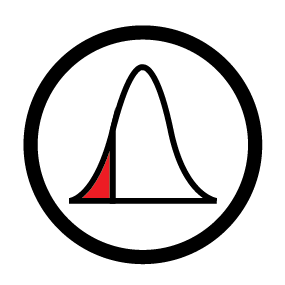

<h1 align="center">Value at Risk </h1>

  
    
    
  </a>
  

Value at risk is a measure of the risk of loss for investments. It estimates how much a set of investments might lose, given normal market conditions, in a set time period with a given level of confidence. `VaR-Plutus21-Template` is Value at Risk template for you to build your own portfolio. Find out more about our fund, <a href="https://www.plutus21.com/">Plutus21 Capital</a>.

## 🤝 Contributing

Contributions, issues and feature requests are welcome. 
[Check the contributing guide](./CONTRIBUTING.md). 

<h1> Quant Team</h1>

<h4> Luke Shirley - Sr. Quantitative Analyst</h4>

- Twitter: [@Lukeshirleyx](https://twitter.com/Lukeshirleyx)
- Github: [@Lukeshirleyx](https://github.com/Lukeshirleyx)

#### Mena Bahram - Sr. Quantitative Analyst

#### Kapil Rampali - Quantitative Analyst

#### Alexis Cisernos - Quantitative Analyst

## 📝 License

Copyright © 2019 [Luke Shirley](https://github.com/Lukeshirleyx). 
This project is [MIT] licensed.

